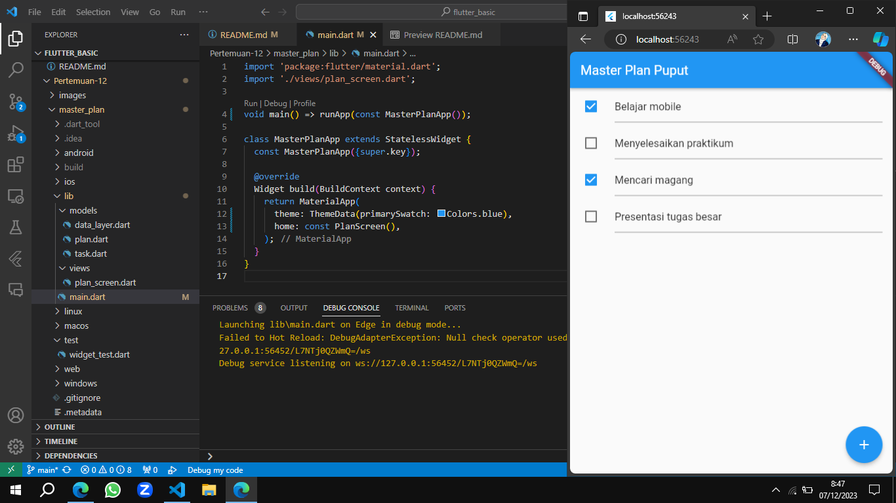
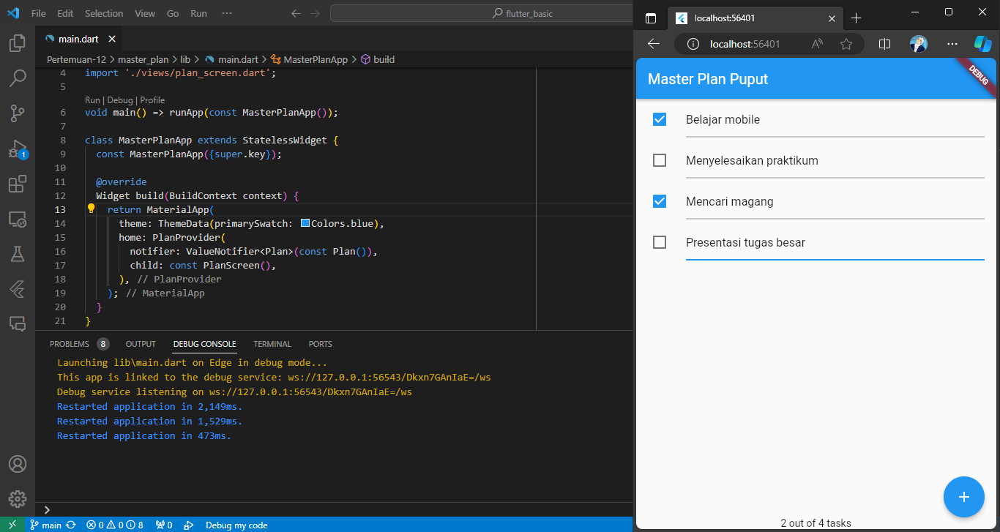
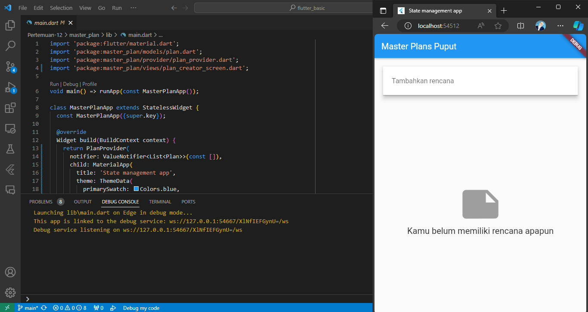

# Dasar State Management

* Nama  : Diah Putri Nofianti
* NIM   : 2141720054
* Absen : 12
* Kelas : TI-3A

## Praktikum 1: Dasar State dengan Model-View
### 1. Buat project `master_plan`
### 2. Membuat model `task.dart`
```dart
class Task {
  final String description;
  final bool complete;

  const Task({this.description = '', this.complete = false});
}
```
### 3. Buat file `plan.dart`
```dart
import './task.dart';

class Plan {
  final String name;
  final List<Task> tasks;

  const Plan({this.name = '', this.tasks = const []});
}
```
### 4. Buat file `data_layer.dart`
```dart
export 'plan.dart';
export 'task.dart';
```
### 5. Isi file `main.dart`
```dart
import 'package:flutter/material.dart';
import './views/plan_screen.dart';

void main() => runApp(const MasterPlanApp());

class MasterPlanApp extends StatelessWidget {
  const MasterPlanApp({super.key});

  @override
  Widget build(BuildContext context) {
    return MaterialApp(
      theme: ThemeData(primarySwatch: Colors.blue),
      home: const PlanScreen(),
    );
  }
}
```
### 6. Buat `plan_screen.dart`
```dart
import '../models/data_layer.dart';
import 'package:flutter/material.dart';

class PlanScreen extends StatefulWidget {
  const PlanScreen({super.key});

  @override
  State createState() => _PlanScreenState();
}

class _PlanScreenState extends State<PlanScreen> {
  Plan plan = const Plan();
  late ScrollController scrollController;

  @override
  void initState() {
    super.initState();
    scrollController = ScrollController()
      ..addListener(() {
        FocusScope.of(context).requestFocus(FocusNode());
      });
  }

  @override
  Widget build(BuildContext context) {
    return Scaffold(
      appBar: AppBar(title: const Text('Master Plan Puput')),
      body: _buildList(),
      floatingActionButton: _buildAddTaskButton(),
    );
  }

  Widget _buildAddTaskButton() {
    return FloatingActionButton(
      child: const Icon(Icons.add),
      onPressed: () {
        setState(() {
          plan = Plan(
            name: plan.name,
            tasks: List<Task>.from(plan.tasks)..add(const Task()),
          );
        });
      },
    );
  }

  Widget _buildList() {
    return ListView.builder(
      itemCount: plan.tasks.length,
      itemBuilder: (context, index) => _buildTaskTile(plan.tasks[index], index),
      controller: scrollController,
      keyboardDismissBehavior: Theme.of(context).platform == TargetPlatform.iOS
          ? ScrollViewKeyboardDismissBehavior.onDrag
          : ScrollViewKeyboardDismissBehavior.manual,
    );
  }

  Widget _buildTaskTile(Task task, int index) {
    return ListTile(
      leading: Checkbox(
          value: task.complete,
          onChanged: (selected) {
            setState(() {
              plan = Plan(
                name: plan.name,
                tasks: List<Task>.from(plan.tasks)
                  ..[index] = Task(
                    description: task.description,
                    complete: selected ?? false,
                  ),
              );
            });
          }),
      title: TextFormField(
        initialValue: task.description,
        onChanged: (text) {
          setState(() {
            plan = Plan(
              name: plan.name,
              tasks: List<Task>.from(plan.tasks)
                ..[index] = Task(
                  description: text,
                  complete: task.complete,
                ),
            );
          });
        },
      ),
    );
  }

  @override
  void dispose() {
    scrollController.dispose();
    super.dispose();
  }
}
```
### Hasil


#### - Berdasarkan hasil dari praktikum ini, jelaskan apa yang telah dibuat!

#### - Jelaskan maksud dari langkah membuat file `data_layer.dart`! Mengapa dilakukan demikian?
 Membuat file `data_layer.dart` bertujuan untuk menggabungkan dan mengekspor model data ke dalam satu file, menyederhanakan proses impor dan meningkatkan keterbacaan kode dalam pengembangan aplikasi. Dengan langkah ini, pengelolaan data layer menjadi lebih efisien dan ringkas.

#### - Mengapa perlu variabel `plan` di dalam `plan_screen.dart`? Mengapa dibuat konstanta?
Variabel `plan` di dalam `plan_screen.dart` digunakan untuk menyimpan instance dari model `Plan`, yang mewakili rencana atau tugas-tugas dalam aplikasi. Penggunaan konstanta (`const`) pada inisialisasi `plan` menunjukkan bahwa objek `Plan` tersebut tetap tidak berubah setelah dibuat. Hal ini dapat bermanfaat jika kita ingin memastikan bahwa objek `plan` tidak dapat diubah nilainya setelah instansiasi, menghindari perubahan tidak disengaja dan memastikan kestabilan data pada tingkat aplikasi.

#### - Apa kegunaan method `initState()` dan `dispose()` dalam *lifecyle state*?
* `initState()` digunakan untuk melakukan inisialisasi suatu objek state sebelum widget tersebut dibangun. Metode ini dipanggil hanya sekali saat widget pertama kali dibuat, merupakan tempat yang baik untuk melakukan pekerjaan inisialisasi yang dibutuhkan, seperti menginisialisasi variabel.

* `dispose()` adalah metode yang dipanggil ketika objek state tersebut dihapus dari widget tree. Terjadi ketika widget dihapus dari tampilan atau ketika widget induknya dihapus. Metode ini berguna untuk membersihkan atau melepaskan sumber daya yang telah dialokasikan oleh objek state.

## Praktikum 2: Mengelola Data Layer dengan InheritedWidget dan InheritedNotifier
### 1. Buat file `plan_provider.dart`
```dart
import 'package:flutter/material.dart';
import '../models/data_layer.dart';

class PlanProvider extends InheritedNotifier<ValueNotifier<Plan>> {
  const PlanProvider({super.key, required Widget child, required
   ValueNotifier<Plan> notifier})
  : super(child: child, notifier: notifier);

  static ValueNotifier<Plan> of(BuildContext context) {
   return context.
    dependOnInheritedWidgetOfExactType<PlanProvider>()!.notifier!;
  }
}
```
### 2. Edit `main.dart`
```dart
return MaterialApp(
  theme: ThemeData(primarySwatch: Colors.purple),
  home: PlanProvider(
    notifier: ValueNotifier<Plan>(const Plan()),
    child: const PlanScreen(),
   ),
);
```
### 3. Tambah method pada model `plan.dart`
```dart
int get completedCount => tasks
  .where((task) => task.complete)
  .length;

String get completenessMessage =>
  '$completedCount out of ${tasks.length} tasks';
```
### 4. Edit `plan_screen.dart`
```dart
import 'package:master_plan/provider/plan_provider.dart';
import '../models/data_layer.dart';
import 'package:flutter/material.dart';

class PlanScreen extends StatefulWidget {
  const PlanScreen({super.key});
  @override
  State createState() => _PlanScreenState();
}

class _PlanScreenState extends State<PlanScreen> {
  late ScrollController scrollController;

  @override
  void initState() {
    super.initState();
    scrollController = ScrollController()
      ..addListener(() {
        FocusScope.of(context).requestFocus(FocusNode());
      });
  }

  @override
  void dispose() {
    scrollController.dispose();
    super.dispose();
  }

  @override
  Widget build(BuildContext context) {
    return Scaffold(
      appBar: AppBar(title: const Text('Master Plan Puput')),
      body: ValueListenableBuilder<Plan>(
        valueListenable: PlanProvider.of(context),
        builder: (context, plan, child) {
          return Column(
            children: [
              Expanded(child: _buildList(plan)),
              SafeArea(
                child: Text(plan.completenessMessage),
              )
            ],
          );
        },
      ),
      floatingActionButton: _buildAddTaskButton(context),
    );
  }

  Widget _buildAddTaskButton(BuildContext context) {
    ValueNotifier<Plan> planNotifier = PlanProvider.of(context);
    return FloatingActionButton(
      child: const Icon(Icons.add),
      onPressed: () {
        Plan currentPlan = planNotifier.value;
        planNotifier.value = Plan(
          name: currentPlan.name,
          tasks: List<Task>.from(currentPlan.tasks)..add(const Task()),
        );
      },
    );
  }

  Widget _buildList(Plan plan) {
    return ListView.builder(
      controller: scrollController,
      itemCount: plan.tasks.length,
      itemBuilder: (context, index) =>
          _buildTaskTile(plan.tasks[index], index, context),
    );
  }

  Widget _buildTaskTile(Task task, int index, BuildContext context) {
    ValueNotifier<Plan> planNotifier = PlanProvider.of(context);
    return ListTile(
      leading: Checkbox(
          value: task.complete,
          onChanged: (selected) {
            Plan currentPlan = planNotifier.value;
            planNotifier.value = Plan(
              name: currentPlan.name,
              tasks: List<Task>.from(currentPlan.tasks)
                ..[index] = Task(
                  description: task.description,
                  complete: selected ?? false,
                ),
            );
          }),
      title: TextFormField(
        initialValue: task.description,
        onChanged: (text) {
          Plan currentPlan = planNotifier.value;
          planNotifier.value = Plan(
            name: currentPlan.name,
            tasks: List<Task>.from(currentPlan.tasks)
              ..[index] = Task(
                description: text,
                complete: task.complete,
              ),
          );
        },
      ),
    );
  }
}
```
### Hasil


#### Jelaskan mana yang dimaksud `InheritedWidget`! Mengapa yang digunakan `InheritedNotifier`?

#### Jelaskan maksud dari method `completedCount()` dan `completenessMessage()`! Mengapa dilakukan demikian?

#### Capture hasil, kemudian jelaskan apa yang telah dibuat!


## Praktikum 3: Membuat State di Multiple Screens
### 1. Edit `plan_provider.dart`
```dart
class PlanProvider extends
InheritedNotifier<ValueNotifier<List<Plan>>> {
  const PlanProvider({super.key, required Widget child, required
ValueNotifier<List<Plan>> notifier})
     : super(child: child, notifier: notifier);

  static ValueNotifier<List<Plan>> of(BuildContext context) {
    return context.
dependOnInheritedWidgetOfExactType<PlanProvider>()!.notifier!;
  }
}
```
### 2. Edit `main.dart`
```dart
@override
Widget build(BuildContext context) {
  return PlanProvider(
    notifier: ValueNotifier<List<Plan>>(const []),
    child: MaterialApp(
      title: 'State management app',
      theme: ThemeData(
        primarySwatch: Colors.blue,
      ),
      home: const PlanScreen(),
    ),
  );
}
```
### 3. Edit `plan_screen.dart`
```dart
import 'package:master_plan/provider/plan_provider.dart';
import '../models/data_layer.dart';
import 'package:flutter/material.dart';

class PlanScreen extends StatefulWidget {
  final Plan plan;
  const PlanScreen({super.key, required this.plan});

  @override
  State createState() => _PlanScreenState();
}

class _PlanScreenState extends State<PlanScreen> {
  late ScrollController scrollController;
  Plan get plan => widget.plan;

  @override
  void initState() {
    super.initState();
    scrollController = ScrollController()
      ..addListener(() {
        FocusScope.of(context).requestFocus(FocusNode());
      });
  }

  @override
  Widget build(BuildContext context) {
    ValueNotifier<List<Plan>> plansNotifier = PlanProvider.of(context);

    return Scaffold(
      appBar: AppBar(title: Text(widget.plan.name)),
      body: ValueListenableBuilder<List<Plan>>(
        valueListenable: plansNotifier,
        builder: (context, plans, child) {
          Plan currentPlan = plans.firstWhere((p) => p.name == plan.name);
          return Column(
            children: [
              Expanded(child: _buildList(currentPlan)),
              SafeArea(child: Text(currentPlan.completenessMessage)),
            ],
          );
        },
      ),
      floatingActionButton: _buildAddTaskButton(
        context,
      ),
    );
  }

  Widget _buildAddTaskButton(BuildContext context) {
    ValueNotifier<List<Plan>> planNotifier = PlanProvider.of(context);
    return FloatingActionButton(
      child: const Icon(Icons.add),
      onPressed: () {
        Plan currentPlan = plan;
        int planIndex =
            planNotifier.value.indexWhere((p) => p.name == currentPlan.name);
        List<Task> updatedTasks = List<Task>.from(currentPlan.tasks)
          ..add(const Task());
        planNotifier.value = List<Plan>.from(planNotifier.value)
          ..[planIndex] = Plan(
            name: currentPlan.name,
            tasks: updatedTasks,
          );
        setState(() {});
      },
    );
  }

  Widget _buildList(Plan plan) {
    return ListView.builder(
      controller: scrollController,
      itemCount: plan.tasks.length,
      itemBuilder: (context, index) =>
          _buildTaskTile(plan.tasks[index], index, context),
    );
  }

  Widget _buildTaskTile(Task task, int index, BuildContext context) {
    ValueNotifier<List<Plan>> planNotifier = PlanProvider.of(context);

    return ListTile(
      leading: Checkbox(
          value: task.complete,
          onChanged: (selected) {
            Plan currentPlan = plan;
            int planIndex = planNotifier.value
                .indexWhere((p) => p.name == currentPlan.name);
            planNotifier.value = List<Plan>.from(planNotifier.value)
              ..[planIndex] = Plan(
                name: currentPlan.name,
                tasks: List<Task>.from(currentPlan.tasks)
                  ..[index] = Task(
                    description: task.description,
                    complete: selected ?? false,
                  ),
              );
          }),
      title: TextFormField(
        initialValue: task.description,
        onChanged: (text) {
          Plan currentPlan = plan;
          int planIndex =
              planNotifier.value.indexWhere((p) => p.name == currentPlan.name);
          planNotifier.value = List<Plan>.from(planNotifier.value)
            ..[planIndex] = Plan(
              name: currentPlan.name,
              tasks: List<Task>.from(currentPlan.tasks)
                ..[index] = Task(
                  description: text,
                  complete: task.complete,
                ),
            );
        },
      ),
    );
  }
}
```
### 4. Buat file `plan_creator_screen.dart`
```dart
import 'package:flutter/material.dart';
import 'package:master_plan/models/plan.dart';
import 'package:master_plan/provider/plan_provider.dart';
import 'package:master_plan/views/plan_screen.dart';

class PlanCreatorScreen extends StatefulWidget {
  const PlanCreatorScreen({super.key});

  @override
  State<PlanCreatorScreen> createState() => _PlanCreatorScreenState();
}

class _PlanCreatorScreenState extends State<PlanCreatorScreen> {
  final textController = TextEditingController();

  @override
  void dispose() {
    textController.dispose();
    super.dispose();
  }

  @override
  Widget build(BuildContext context) {
    return Scaffold(
      appBar: AppBar(title: const Text('Master Plans Puput')),
      body: Column(children: [
        _buildListCreator(),
        Expanded(child: _buildMasterPlans())
      ]),
    );
  }

  Widget _buildListCreator() {
    return Padding(
        padding: const EdgeInsets.all(20.0),
        child: Material(
          color: Theme.of(context).cardColor,
          elevation: 10,
          child: TextField(
              controller: textController,
              decoration: const InputDecoration(
                  labelText: 'Tambahkan rencana',
                  contentPadding: EdgeInsets.all(20)),
              onEditingComplete: addPlan),
        ));
  }

  void addPlan() {
    final text = textController.text;
    if (text.isEmpty) {
      return;
    }
    final plan = Plan(name: text, tasks: []);
    ValueNotifier<List<Plan>> planNotifier = PlanProvider.of(context);
    planNotifier.value = List<Plan>.from(planNotifier.value)..add(plan);
    textController.clear();
    FocusScope.of(context).requestFocus(FocusNode());
    setState(() {});
  }

  Widget _buildMasterPlans() {
    ValueNotifier<List<Plan>> planNotifier = PlanProvider.of(context);
    List<Plan> plans = planNotifier.value;

    if (plans.isEmpty) {
      return Column(
          mainAxisAlignment: MainAxisAlignment.center,
          children: <Widget>[
            const Icon(Icons.note, size: 100, color: Colors.grey),
            Text('Kamu belum memiliki rencana apapun',
                style: Theme.of(context).textTheme.titleLarge)
          ]);
    }
    return ListView.builder(
        itemCount: plans.length,
        itemBuilder: (context, index) {
          final plan = plans[index];
          return ListTile(
              title: Text(plan.name),
              subtitle: Text(plan.completenessMessage),
              onTap: () {
                Navigator.of(context).push(MaterialPageRoute(
                    builder: (_) => PlanScreen(
                          plan: plan,
                        )));
              });
        });
  }
}
```
### Hasil


### Berdasarkan praktikum yang telah dilakukan, jelaskan maksud dari gambar diagram berikut ini!

* Jawab

#### Capture hasil, kemudian jelaskan apa yang telah dibuat!