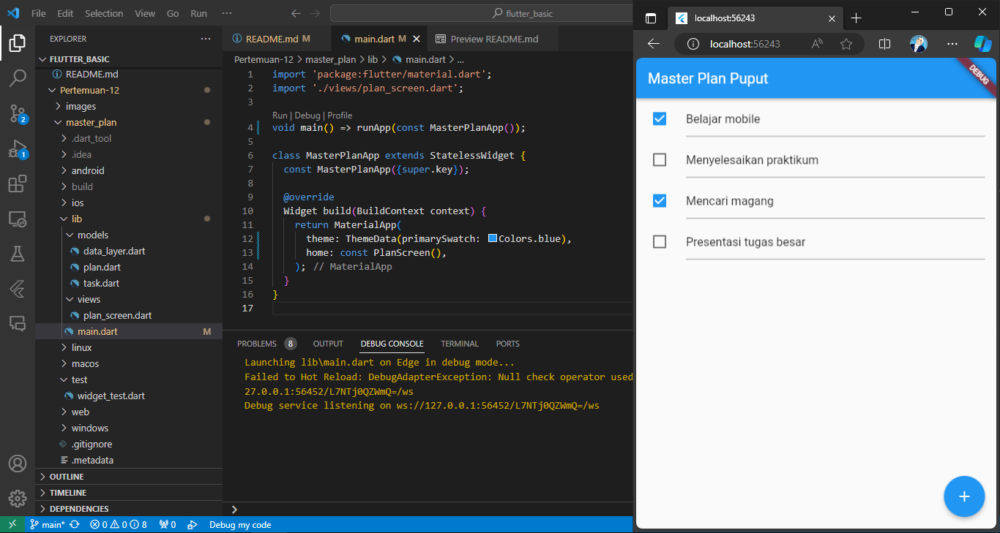

# Dasar State Management

* Nama  : Diah Putri Nofianti
* NIM   : 2141720054
* Absen : 12
* Kelas : TI-3A

## Praktikum 1: Dasar State dengan Model-View
### 1. Buat project `master_plan`
### 2. Membuat model `task.dart`
```dart
class Task {
  final String description;
  final bool complete;

  const Task({this.description = '', this.complete = false});
}
```
### 3. Buat file `plan.dart`
```dart
import './task.dart';

class Plan {
  final String name;
  final List<Task> tasks;

  const Plan({this.name = '', this.tasks = const []});
}
```
### 4. Buat file `data_layer.dart`
```dart
export 'plan.dart';
export 'task.dart';
```
### 5. Isi file `main.dart`
```dart
import 'package:flutter/material.dart';
import './views/plan_screen.dart';

void main() => runApp(const MasterPlanApp());

class MasterPlanApp extends StatelessWidget {
  const MasterPlanApp({super.key});

  @override
  Widget build(BuildContext context) {
    return MaterialApp(
      theme: ThemeData(primarySwatch: Colors.blue),
      home: const PlanScreen(),
    );
  }
}
```
### 6. Buat `plan_screen.dart`
```dart
import '../models/data_layer.dart';
import 'package:flutter/material.dart';

class PlanScreen extends StatefulWidget {
  const PlanScreen({super.key});

  @override
  State createState() => _PlanScreenState();
}

class _PlanScreenState extends State<PlanScreen> {
  Plan plan = const Plan();
  late ScrollController scrollController;

  @override
  void initState() {
    super.initState();
    scrollController = ScrollController()
      ..addListener(() {
        FocusScope.of(context).requestFocus(FocusNode());
      });
  }

  @override
  Widget build(BuildContext context) {
    return Scaffold(
      appBar: AppBar(title: const Text('Master Plan Puput')),
      body: _buildList(),
      floatingActionButton: _buildAddTaskButton(),
    );
  }

  Widget _buildAddTaskButton() {
    return FloatingActionButton(
      child: const Icon(Icons.add),
      onPressed: () {
        setState(() {
          plan = Plan(
            name: plan.name,
            tasks: List<Task>.from(plan.tasks)..add(const Task()),
          );
        });
      },
    );
  }

  Widget _buildList() {
    return ListView.builder(
      itemCount: plan.tasks.length,
      itemBuilder: (context, index) => _buildTaskTile(plan.tasks[index], index),
      controller: scrollController,
      keyboardDismissBehavior: Theme.of(context).platform == TargetPlatform.iOS
          ? ScrollViewKeyboardDismissBehavior.onDrag
          : ScrollViewKeyboardDismissBehavior.manual,
    );
  }

  Widget _buildTaskTile(Task task, int index) {
    return ListTile(
      leading: Checkbox(
          value: task.complete,
          onChanged: (selected) {
            setState(() {
              plan = Plan(
                name: plan.name,
                tasks: List<Task>.from(plan.tasks)
                  ..[index] = Task(
                    description: task.description,
                    complete: selected ?? false,
                  ),
              );
            });
          }),
      title: TextFormField(
        initialValue: task.description,
        onChanged: (text) {
          setState(() {
            plan = Plan(
              name: plan.name,
              tasks: List<Task>.from(plan.tasks)
                ..[index] = Task(
                  description: text,
                  complete: task.complete,
                ),
            );
          });
        },
      ),
    );
  }

  @override
  void dispose() {
    scrollController.dispose();
    super.dispose();
  }
}
```
### Hasil


* Jelaskan maksud dari langkah membuat file `data_layer.dart`! Mengapa dilakukan demikian?

* Mengapa perlu variabel `plan` di dalam `plan_screen.dart`? Mengapa dibuat konstanta?

* Apa kegunaan method `initState()` dan `dispose()` dalam lifecyle state ?

* Tampilkan hasil praktikum ini, kemudian jelaskan apa yang telah dibuat!


## Praktikum 2: Mengelola Data Layer dengan InheritedWidget dan InheritedNotifier