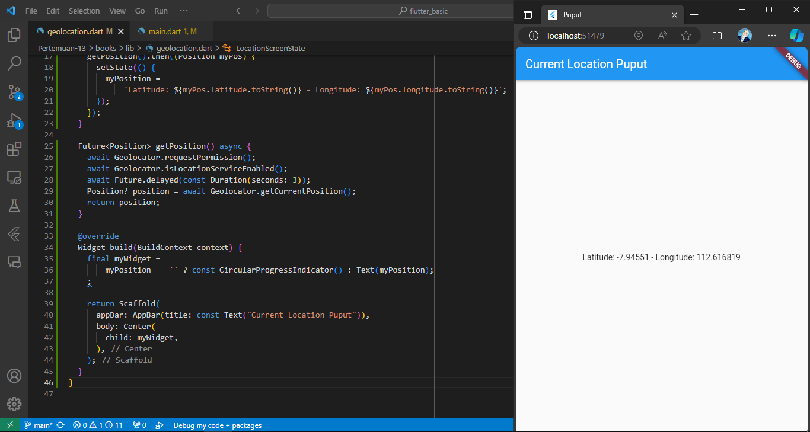
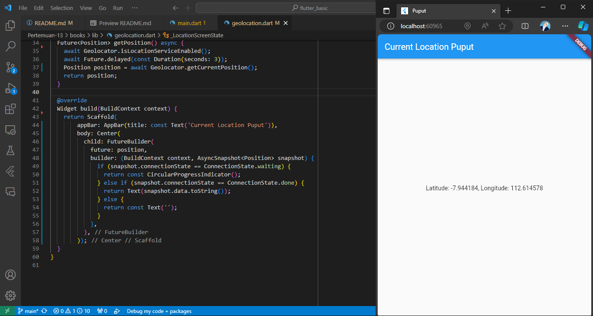
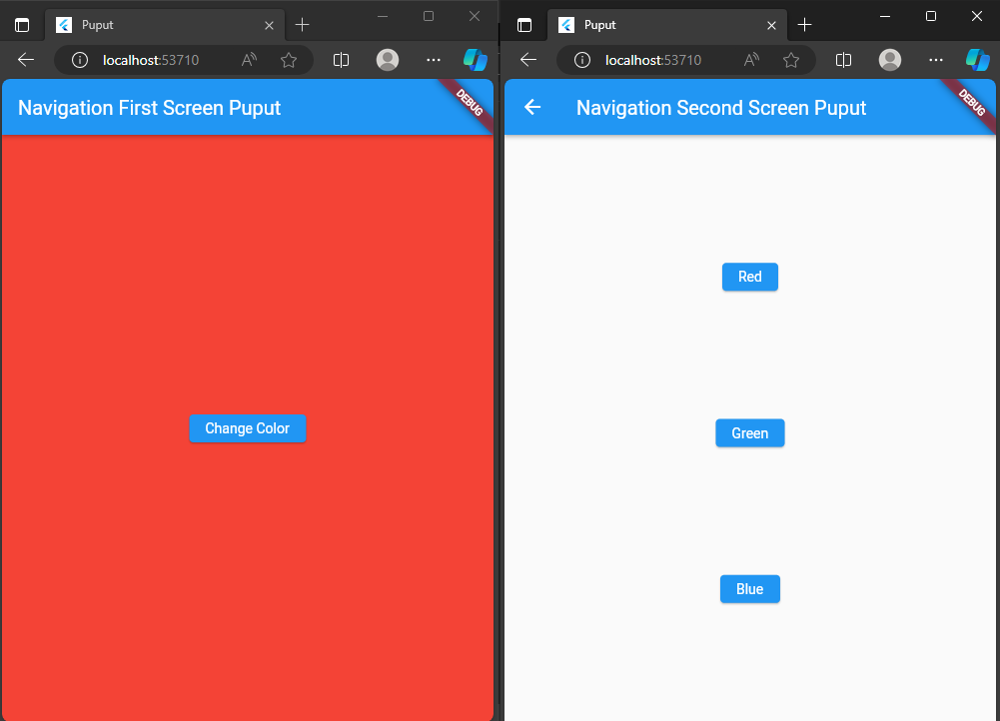
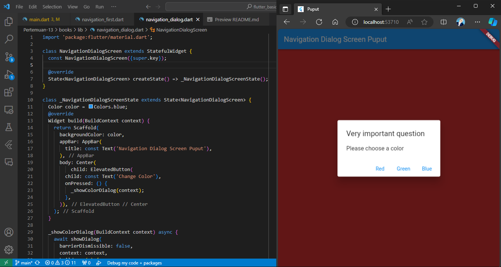

# Pemrograman Asynchronous

* Nama  : Diah Putri Nofianti
* NIM   : 2141720054
* Absen : 12
* Kelas : TI-3A

## Praktikum 1: Mengunduh Data dari Web Service (API)

### Langkah 1: Buat project baru
Buat sebuah project flutter baru dengan nama `books`. Tambah dependensi `http` dengan mengetik perintah di terminal.
```dart
flutter pub add http
```

### Langkah 2: Cek file `pubspec.yaml`
Jika berhasil install plugin, pastikan plugin `http` telah ada di file `pubspec` seperti berikut.
```dart
dependencies:
  flutter:
    sdk: flutter
  http: ^1.1.0
```

### Langkah 3: Buka file `main.dart`
```dart
import 'package:flutter/material.dart';
import 'dart:async';
import 'package:http/http.dart';
import 'package:http/http.dart' as http;

void main() {
  runApp(const MyApp());
}

class MyApp extends StatelessWidget {
  const MyApp({super.key});

  @override
  Widget build(BuildContext context) {
    return MaterialApp(
      title: 'Puput',
      theme: ThemeData(
        primarySwatch: Colors.blue,
        visualDensity: VisualDensity.adaptivePlatformDensity,
      ),
      home: const FuturePage(),
    );
  }
}

class FuturePage extends StatefulWidget {
  const FuturePage({super.key});

  @override
  State<FuturePage> createState() => _FuturePageState();
}

class _FuturePageState extends State<FuturePage> {
  String result = '';
  bool isLoading = false;
  @override
  Widget build(BuildContext context) {
    return Scaffold(
      appBar: AppBar(
        title: const Text('Back from the Future'),
      ),
      body: Center(
        child: Column(children: [
          const Spacer(),
          ElevatedButton(
            child: const Text('GO!'),
            onPressed: () {},
          ),
          const Spacer(),
          isLoading ? const CircularProgressIndicator() : Text(result),
          const Spacer(),
        ]),
      ),
    );
  }
}
```

### Langkah 4: Tambah method `getData()`
```dart
  Future<Response> getData() async {
    const authority = 'www.googleapis.com';
    const path = '/books/v1/volumes/EoNqEAAAQBAJ';
    Uri url = Uri.https(authority, path);
    return await http.get(url);
  }
```
#### Cari judul buku favorit di Google Books, lalu ganti ID buku pada variabel `path`. Lalu coba akses URI di browser. Jika menampilkan data JSON, maka telah berhasil.


### Langkah 5: Tambah kode di `ElevatedButton`
```dart
 ElevatedButton(
            child: const Text('GO!'),
            onPressed: () {
              setState(() {
                isLoading = true;
              });
              Future.delayed(const Duration(seconds: 1)).then(((value) {
                getData().then((value) {
                  result = value.body.toString().substring(0, 450);
                  setState(() {
                    isLoading = false;
                  });
                }).catchError((e) {
                  result = "An error occured $e";
                  setState(() {
                    isLoading = false;
                  });
                });
              }));
            },
          ),          
```

#### Jelaskan terkait `substring` dan `catchError`!
Pada bagian ini, metode `substring(0, 450)` digunakan untuk mengambil sebagian substring dari hasil respons yang diterima. Dengan parameter 0 dan 450, itu akan mengambil karakter dari indeks 0 hingga indeks 449, termasuk karakter 0 dan tidak termasuk karakter 450.

Sementara itu, blok `catchError` digunakan untuk menangani kesalahan yang mungkin terjadi selama pemrosesan data. Jika ada kesalahan, blok ini akan menangkap pengecualian dan mengubah nilai `result` menjadi pesan kesalahan yang sesuai. Kemudian, dengan menggunakan `setState`, variabel `isLoading` diatur kembali ke `false` untuk menghentikan indikator loading setelah penanganan kesalahan selesai.

### Hasil


## Praktikum 2: Menggunakan await/async untuk menghindari callbacks

### Langkah 1: Buka file `main.dart`
```dart
Future<int> returnOneAsync() async {
  await Future.delayed(const Duration(seconds: 3));
  return 1;
}

Future<int> returnTwoAsync() async {
  await Future.delayed(const Duration(seconds: 3));
  return 2;
}

Future<int> returnThreeAsync() async {
  await Future.delayed(const Duration(seconds: 3));
  return 3;
}
```

### Langkah 2: Tambah method `count()`
```dart
Future count() async {
    int total = 0;
    total = await returnOneAsync();
    total += await returnTwoAsync();
    total += await returnThreeAsync();
    setState(() {
      result = total.toString();
    });
  }
```

### Langkah 3: Panggil `count()`
```dart
ElevatedButton(
            child: const Text('GO!'),
            onPressed: () {
              count();
            }
        )
```

### Hasil


#### Jelaskan maksud praktikum ini!
Praktikum ini bertujuan untuk mengenalkan `async` dan `await`. Kita dapat menangani pemanggilan fungsi yang membutuhkan waktu (asynchronous) tanpa menggunakan callback yang kompleks. Dalam langkah-langkah yang diberikan, tiga fungsi `returnOneAsync`, `returnTwoAsync`, dan `returnThreeAsync` ditambahkan dengan simulasi penundaan menggunakan `await Future.delayed` untuk memperlihatkan kegunaan `await` dalam menangani operasi yang membutuhkan waktu. Selanjutnya, dibuat method baru bernama `count()` yang menggunakan `await` untuk menunggu hasil dari tiga fungsi tersebut dan kemudian menjumlahkannya. Metode ini dihubungkan dengan tombol "GO!" sehingga ketika tombol ditekan, hasil penjumlahan akan diupdate dan ditampilkan.

## Praktikum 3: Menggunakan Completer di Future

### Langkah 1: Buka `main.dart`
```dart
import 'package:async/async.dart';
```

### Langkah 2: Tambahkan variabel dan method
```dart
late Completer completer;

Future getNumber() {
  completer = Completer<int>();
  calculate();
  return completer.future;
}

Future calculate() async {
  await Future.delayed(const Duration(seconds : 5));
  completer.complete(42);
}
```

### Langkah 3: Ganti isi kode `onPressed()`
```dart
onPressed: () {
    getNumber().then((value) {
        setState(() {
            result = value.toString();
        });
    })
},
```

### Langkah 4: Ganti method `calculate()`
```dart
calculate() async {
    try {
      await Future.delayed(const Duration(seconds: 5));
      completer.complete(42);
    } catch (e) {
      completer.completeError({});
    }
  }
```

### Langkah 5: Pindah ke `onPressed()`
```dart
getNumber().then((value) {
  setState(() {
    result = value.toString();
  });
}).catchError((e) {
  result = 'An error occurred';
});
```

### Hasil


#### Jelaskan maksud perbedaan kode langkah 2 dengan langkah 4-5 tersebut!
Pada langkah 2, variabel `completer` dideklarasikan sebagai `late Completer`, dan kemudian metode `getNumber` dan `calculate` diimplementasikan. `getNumber` menginisialisasi `completer` sebagai `Completer<int>` dan kemudian memanggil `calculate`, yang menunggu selama 5 detik menggunakan `await Future.delayed` sebelum menyelesaikan `completer` dengan nilai 42.

Pada langkah 4, dalam method `calculate`, ditambahkan blok `try-catch` untuk menangkap error yang mungkin terjadi selama penundaan. Jika terjadi error, `completer` diselesaikan dengan menggunakan `completeError({})`.

Pada langkah 5, dalam `onPressed`, setelah pemanggilan `getNumber()`, ditambahkan blok `catchError` untuk menangkap error yang mungkin terjadi selama eksekusi. Jika ada error, variabel `result` diupdate dengan pesan kesalahan.

Perbedaan ini memberikan perlindungan lebih terhadap kesalahan yang mungkin terjadi selama eksekusi asynchronous, dan dengan menangkap error menggunakan `completeError`, kita dapat memberikan penanganan yang lebih baik terhadap situasi yang tidak terduga.

## Praktikum 4: Memanggil Future secara paralel

### Langkah 1: Buka file `main.dart`
```dart
void returnFG() {
    FutureGroup<int> futureGroup = FutureGroup<int>();
    futureGroup.add(returnOneAsync());
    futureGroup.add(returnTwoAsync());
    futureGroup.add(returnThreeAsync());
    futureGroup.close();
    futures.then((value) {
      int total = 0;
      for (var element in value) {
        total += element;
      }
      setState(() {
        result = total.toString();
      });
    });
  }
```

###  Langkah 2: Edit `onPressed()`
```dart
onPressed: () {
    returnFG();
},
```

### Langkah 3: Ganti variabel futureGroup
```dart
final futures = Future.wait<int>([
  returnOneAsync(),
  returnTwoAsync(),
  returnThreeAsync(),
]);
```

#### Jelaskan maksud perbedaan kode langkah 1 dan 3!
Perbedaan utama antara langkah 1 dan langkah 3 terletak pada penggunaan `FutureGroup`. Pada langkah 1, `FutureGroup` digunakan untuk mengelola beberapa future secara paralel. Metode `add` digunakan untuk menambahkan setiap future ke dalam `FutureGroup`, dan `close` menandakan bahwa tidak ada future tambahan yang akan ditambahkan. Di sisi lain, langkah 3 menggunakan `Future.wait` untuk menggabungkan beberapa future menjadi satu future tunggal yang menunggu hingga semua future selesai.

Jadi, perbedaan ini mencerminkan pendekatan berbeda dalam mengelola future secara paralel. `FutureGroup` memberikan kontrol lebih langsung terhadap setiap future, sementara `Future.wait` menyatukan hasil dari beberapa future menjadi satu setelah semuanya selesai.

## Praktikum 5: Menangani Respon Error pada Async Code

### Langkah 1: Buka file `main.dart`
```dart
  Future returnError() async {
    await Future.delayed(const Duration(seconds: 2));
    throw Exception('Error');
  }
```

### Langkah 2: ElevatedButton
```dart
ElevatedButton(
  onPressed: () {
    returnError().then((value) {
      setState(() {
        result = 'Success';
        });
        }).catchError((onError) {
          setState(() {
            result = onError.toString();
        });
      }).whenComplete(() => print('Completed'));
   },
   child: const Text("GO!"),
 ),
```

### Langkah 3: Tambah method `handleError()`
```dart
Future handleError() async {
    try {
      await returnError();
    } catch (error) {
      setState(() {
        result = error.toString();
      });
    } finally {
      print('Completed');
    }
  }
```

### Hasil


#### Jelaskan perbedaan kode langkah 1 dan 3! 
Pada Langkah 1, sebuah fungsi asinkron (`returnError()`) didefinisikan untuk memberikan respon error setelah beberapa waktu tertentu. Fungsi ini kemudian dipanggil dari dalam `onPressed` pada ElevatedButton pada Langkah 2 menggunakan `then` dan `catchError` untuk menangani hasil sukses atau kesalahan.

Pada Langkah 3, metode baru bernama `handleError()` ditambahkan. Metode ini menggunakan struktur `try`, `catch`, dan `finally` untuk menangani potensi kesalahan yang mungkin terjadi saat memanggil `returnError()`. Dengan menggunakan `try`, program mencoba mengeksekusi `returnError()`. Jika terjadi kesalahan, blok `catch` akan menangkap dan menangani kesalahan tersebut, yang pada gilirannya mengubah nilai variabel `result` yang diteruskan ke antarmuka pengguna. Blok `finally` akan selalu dijalankan, terlepas dari kesalahan atau tidaknya, untuk mengeksekusi kode yang perlu dilakukan setelah blok `try` dan/atau `catch` selesai.

## Praktikum 6: Menggunakan Future dengan StatefulWidget

### Langkah 1: install plugin geolocator
```dart
flutter pub add geolocator
```

### Langkah 2: Tambah permission GPS
Untuk platform Android, maka tambahkan baris kode berikut di file `android/app/src/main/androidmanifest.xml`
```dart
<uses-permission android:name="android.permission.ACCESS_FINE_LOCATION"/>
<uses-permission android:name="android.permission.ACCESS_COARSE_LOCATION"/>
```

Untuk platform iOS, maka tambahkan kode ini ke file `Info.plist`
```dart
<key>NSLocationWhenInUseUsageDescription</key>
<string>This app needs to access your location</string>
```
### Langkah 3: Buat file geolocation.dart
```dart
import 'package:flutter/material.dart';
import 'package:geolocator/geolocator.dart';

class LocationScreen extends StatefulWidget {
  const LocationScreen({super.key});

  @override
  State<LocationScreen> createState() => _LocationScreenState();
}

class _LocationScreenState extends State<LocationScreen> {
  String myPosition = '';

  @override
  void initState() {
    super.initState();
    getPosition().then((Position myPos) {
      setState(() {
        myPosition =
            'Latitude: ${myPos.latitude.toString()} - Longitude: ${myPos.longitude.toString()}';
      });
    });
  }

  Future<Position> getPosition() async {
    await Geolocator.requestPermission();
    await Geolocator.isLocationServiceEnabled();
    await Future.delayed(const Duration(seconds: 3));
    Position? position = await Geolocator.getCurrentPosition();
    return position;
  }

  @override
  Widget build(BuildContext context) {
    final myWidget =
        myPosition == '' ? const CircularProgressIndicator() : Text(myPosition);
    ;

    return Scaffold(
      appBar: AppBar(title: const Text("Current Location Puput")),
      body: Center(
        child: myWidget,
      ),
    );
  }
}
```

## Hasil


#### Apakah didapatkan koordinat GPS ketika run di browser? Mengapa demikian?
Ketika menjalankan aplikasi Flutter di browser, koordinat GPS masih dapat diperoleh meskipun tidak ditambahkan izin secara langsung ke AndroidManifest. Hal ini disebabkan oleh Flutter web yang menggunakan API Geolocation langsung dari browser, dan izin untuk mengakses lokasi dikelola oleh browser tersebut, bukan oleh sistem operasi. Sehingga, izin akses lokasi akan dikelola oleh browser yang digunakan dan koordinat GPS dapat diperoleh sesuai dengan izin yang diberikan oleh pengguna melalui browser.

## Praktikum 7: Manajemen Future dengan FutureBuilder

### Langkah 1: Modifikasi method `getPosition()`
```dart
Future<Position> getPosition() async{
  await Geolocator.isLocationServiceEnabled();
  await Future.delayed(const Duration(seconds: 3));
  Position position = await Geolocator.getCurrentPosition();
  return position;
}
```

### Langkah 2: Tambah variabel di class `_LocationScreenState`
```dart
Future<Position>? position;
```

### Langkah 3: Tambah `initState()`
```dart
@override
void initState(){
  super.initState();
  position = getPosition();
}
```

### Langkah 4: Edit method `build()`
```dart
@override
Widget build(BuildContext context){
  return Scaffold(
    appBar: AppBar(title: Text('Current Location')),
    body: Center(child: FutureBuilder(
      future: position,
      builder: (BuildContext context, AsyncSnapshot<Position> snapshot){
        if(snapshot.connectionState == ConnectionState.waiting){
          return const CircularProgressIndicator();
        }
        else if(snapshot.connectionState == ConnectionState.done){
          return Text(snapshot.data.toString());
        }
        else{
          return const Text('');
        }
      },
    ),
  ));
}
```

### Langkah 5: Tambah handling error
```dart
else if(snapshot.connectionState == ConnectionState.done){
  if(snapshot.hasError){
    return Text('Something terrible happened!');
  }
  return Text(snapshot.data.toString());
}
```

### Apakah ada perbedaan UI dengan praktikum sebelumnya? Mengapa demikian?


Pada praktikum sebelumnya, UI menunjukkan tampilan loading menggunakan CircularProgressIndicator di tengah layar selama aplikasi menunggu hasil dari pemanggilan fungsi `getPosition()`. Sementara itu, dalam langkah-langkah dengan `FutureBuilder`, UI menjadi lebih responsif dan bersih, yang akan menampilkan tampilan loading saat menunggu, kemudian menampilkan hasil atau pesan kesalahan setelah pemanggilan fungsi selesai.

## Praktikum 8: Navigation route dengan Future Function

### Langkah 1: Buat file baru `navigation_first.dart`
```dart
import 'package:flutter/material.dart';
import 'package:books/navigation_second.dart';

class NavigationFirst extends StatefulWidget {
  const NavigationFirst({super.key});

  @override
  State<NavigationFirst> createState() => _NavigationFirstState();
}

class _NavigationFirstState extends State<NavigationFirst> {
  Color color = Colors.blue;
  @override
  Widget build(BuildContext context) {
    return Scaffold(
      backgroundColor: color,
      appBar: AppBar(
        title: const Text('Navigation First Screen Puput'),
      ),
      body: Center(
        child: ElevatedButton(
          child: const Text('Change Color'),
          onPressed: () {
            _navigateAndGetColor(context);
          },
        ),
      ),
    );
  }

  Future _navigateAndGetColor(BuildContext context) async {
    color = await Navigator.push(
          context,
          MaterialPageRoute(builder: (context) => const NavigationSecond()),
        ) ??
        Colors.blue;
    setState(() {});
  }
}
```

### Langkah 2: Buat file baru `navigation_second.dart`
```dart
import 'package:flutter/material.dart';

class NavigationSecond extends StatefulWidget {
  const NavigationSecond({Key? key}) : super(key: key);

  @override
  _NavigationSecondState createState() => _NavigationSecondState();
}

class _NavigationSecondState extends State<NavigationSecond> {
  @override
  Widget build(BuildContext context) {
    Color color;
    return Scaffold(
      appBar: AppBar(
        title: const Text('Navigation Second Screen Puput'),
      ),
      body: Center(
        child: Column(
          mainAxisAlignment: MainAxisAlignment.spaceEvenly,
          children: [
            ElevatedButton(
              child: const Text('Red'),
              onPressed: () {
                color = Colors.red;
                Navigator.pop(context, color);
              },
            ),
            ElevatedButton(
              child: const Text('Green'),
              onPressed: () {
                color = Colors.green;
                Navigator.pop(context, color);
              },
            ),
            ElevatedButton(
              child: const Text('Blue'),
              onPressed: () {
                color = Colors.blue;
                Navigator.pop(context, color);
              },
            ),
          ],
        ),
      ),
    );
  }
}
```

### Hasil


#### Cobalah klik setiap button, apa yang terjadi? Mengapa demikian?
Ketika tombol ditekan, perubahan akan terjadi pada warnanya sesuai dengan konfigurasi yang telah didefinisikan dalam `ElevatedButton()` di dalam kelas `navigation_second.dart`. Hal ini terjadi karena terdapat fungsi `Navigation.pop()` yang dipanggil pada setiap tombol dengan menggunakan parameter berupa konteks dan warna yang telah ditetapkan sebelumnya. Oleh karena itu, setiap kali tombol ditekan, warna yang muncul akan berubah sesuai dengan nilai variabel warna yang telah diatur sebelumnya.

## Praktikum 9: Memanfaatkan async/await dengan Widget Dialog

### Langkah 1: Buat file baru `navigation_dialog.dart`
```dart
import 'package:flutter/material.dart';

class NavigationDialogScreen extends StatefulWidget {
  const NavigationDialogScreen({super.key});

  @override
  State<NavigationDialogScreen> createState() => _NavigationDialogScreenState();
}

class _NavigationDialogScreenState extends State<NavigationDialogScreen> {
  Color color = Colors.blue;
  @override
  Widget build(BuildContext context) {
    return Scaffold(
      backgroundColor: color,
      appBar: AppBar(
        title: const Text('Navigation Dialog Screen Puput'),
      ),
      body: Center(
          child: ElevatedButton(
        child: const Text('Change Color'),
        onPressed: () {
          _showColorDialog(context);
        },
      )),
    );
  }

  _showColorDialog(BuildContext context) async {
    await showDialog(
      barrierDismissible: false,
      context: context,
      builder: (_) {
        return AlertDialog(
          title: const Text('Very important question'),
          content: const Text('Please choose a color'),
          actions: <Widget>[
            TextButton(
                child: const Text('Red'),
                onPressed: () {
                  color = Colors.red.shade700;
                  Navigator.pop(context, color);
                }),
            TextButton(
                child: const Text('Green'),
                onPressed: () {
                  color = Colors.green.shade700;
                  Navigator.pop(context, color);
                }),
            TextButton(
                child: const Text('Blue'),
                onPressed: () {
                  color = Colors.blue.shade700;
                  Navigator.pop(context, color);
                }),
          ],
        );
      },
    );
    setState(() {});
  }
}
```

### Hasil


#### Cobalah klik setiap button, apa yang terjadi? Mengapa demikian?
Ketika tombol **Change Color** ditekan dan suatu warna dipilih dari dialog, hasilnya adalah perubahan warna latar belakang layar sesuai dengan pilihan yang dibuat pada dialog tersebut. Mekanisme ini terjadi karena nilai variabel color diperbarui dengan warna yang dipilih melalui fungsi `_showColorDialog`, dan selanjutnya, widget diperbarui menggunakan ``setState``. Proses ini mengakibatkan widget dibangun kembali, dan hasilnya adalah tampilan layar yang memperlihatkan perubahan warna yang telah dipilih.