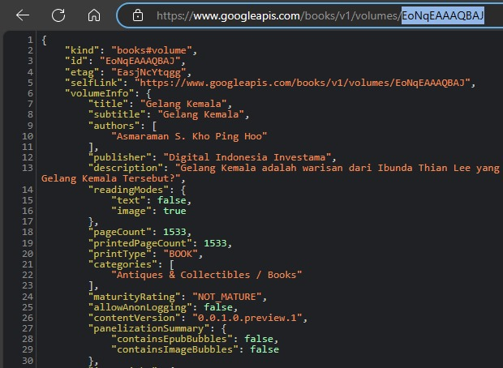
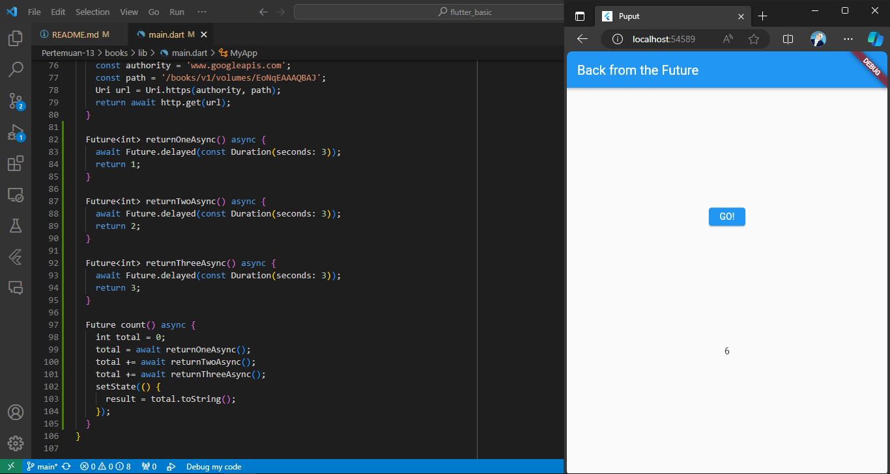
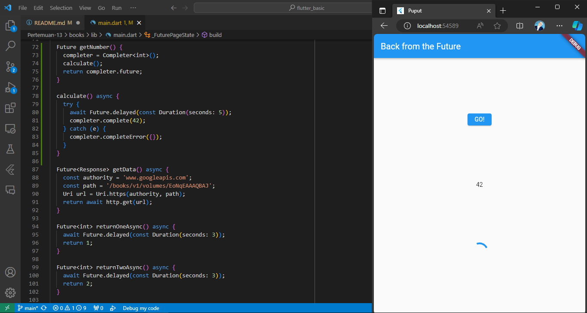
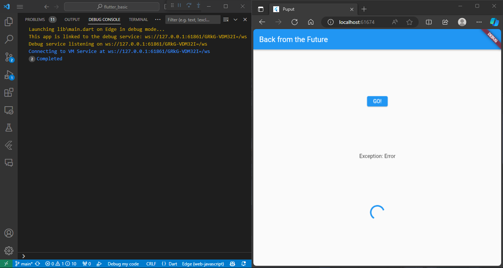

# Pemrograman Asynchronous

* Nama  : Diah Putri Nofianti
* NIM   : 2141720054
* Absen : 12
* Kelas : TI-3A

## Praktikum 1: Mengunduh Data dari Web Service (API)

### Langkah 1: Buat project baru
Buat sebuah project flutter baru dengan nama `books`. Tambah dependensi `http` dengan mengetik perintah di terminal.
```dart
flutter pub add http
```

### Langkah 2: Cek file `pubspec.yaml`
Jika berhasil install plugin, pastikan plugin `http` telah ada di file `pubspec` seperti berikut.
```dart
dependencies:
  flutter:
    sdk: flutter
  http: ^1.1.0
```

### Langkah 3: Buka file `main.dart`
```dart
import 'package:flutter/material.dart';
import 'dart:async';
import 'package:http/http.dart';
import 'package:http/http.dart' as http;

void main() {
  runApp(const MyApp());
}

class MyApp extends StatelessWidget {
  const MyApp({super.key});

  @override
  Widget build(BuildContext context) {
    return MaterialApp(
      title: 'Puput',
      theme: ThemeData(
        primarySwatch: Colors.blue,
        visualDensity: VisualDensity.adaptivePlatformDensity,
      ),
      home: const FuturePage(),
    );
  }
}

class FuturePage extends StatefulWidget {
  const FuturePage({super.key});

  @override
  State<FuturePage> createState() => _FuturePageState();
}

class _FuturePageState extends State<FuturePage> {
  String result = '';
  bool isLoading = false;
  @override
  Widget build(BuildContext context) {
    return Scaffold(
      appBar: AppBar(
        title: const Text('Back from the Future'),
      ),
      body: Center(
        child: Column(children: [
          const Spacer(),
          ElevatedButton(
            child: const Text('GO!'),
            onPressed: () {},
          ),
          const Spacer(),
          isLoading ? const CircularProgressIndicator() : Text(result),
          const Spacer(),
        ]),
      ),
    );
  }
}
```

### Langkah 4: Tambah method `getData()`
```dart
  Future<Response> getData() async {
    const authority = 'www.googleapis.com';
    const path = '/books/v1/volumes/EoNqEAAAQBAJ';
    Uri url = Uri.https(authority, path);
    return await http.get(url);
  }
```
#### Cari judul buku favorit di Google Books, lalu ganti ID buku pada variabel `path`. Lalu coba akses URI di browser. Jika menampilkan data JSON, maka telah berhasil.


### Langkah 5: Tambah kode di `ElevatedButton`
```dart
 ElevatedButton(
            child: const Text('GO!'),
            onPressed: () {
              setState(() {
                isLoading = true;
              });
              Future.delayed(const Duration(seconds: 1)).then(((value) {
                getData().then((value) {
                  result = value.body.toString().substring(0, 450);
                  setState(() {
                    isLoading = false;
                  });
                }).catchError((e) {
                  result = "An error occured $e";
                  setState(() {
                    isLoading = false;
                  });
                });
              }));
            },
          ),          
```

#### Jelaskan terkait `substring` dan `catchError`!
Pada bagian ini, metode `substring(0, 450)` digunakan untuk mengambil sebagian substring dari hasil respons yang diterima. Dengan parameter 0 dan 450, itu akan mengambil karakter dari indeks 0 hingga indeks 449, termasuk karakter 0 dan tidak termasuk karakter 450.

Sementara itu, blok `catchError` digunakan untuk menangani kesalahan yang mungkin terjadi selama pemrosesan data. Jika ada kesalahan, blok ini akan menangkap pengecualian dan mengubah nilai `result` menjadi pesan kesalahan yang sesuai. Kemudian, dengan menggunakan `setState`, variabel `isLoading` diatur kembali ke `false` untuk menghentikan indikator loading setelah penanganan kesalahan selesai.

### Hasil


## Praktikum 2: Menggunakan await/async untuk menghindari callbacks

### Langkah 1: Buka file `main.dart`
```dart
Future<int> returnOneAsync() async {
  await Future.delayed(const Duration(seconds: 3));
  return 1;
}

Future<int> returnTwoAsync() async {
  await Future.delayed(const Duration(seconds: 3));
  return 2;
}

Future<int> returnThreeAsync() async {
  await Future.delayed(const Duration(seconds: 3));
  return 3;
}
```

### Langkah 2: Tambah method `count()`
```dart
Future count() async {
    int total = 0;
    total = await returnOneAsync();
    total += await returnTwoAsync();
    total += await returnThreeAsync();
    setState(() {
      result = total.toString();
    });
  }
```

### Langkah 3: Panggil `count()`
```dart
ElevatedButton(
            child: const Text('GO!'),
            onPressed: () {
              count();
            }
        )
```

### Hasil


#### Jelaskan maksud praktikum ini!
Praktikum ini bertujuan untuk mengenalkan `async` dan `await`. Kita dapat menangani pemanggilan fungsi yang membutuhkan waktu (asynchronous) tanpa menggunakan callback yang kompleks. Dalam langkah-langkah yang diberikan, tiga fungsi `returnOneAsync`, `returnTwoAsync`, dan `returnThreeAsync` ditambahkan dengan simulasi penundaan menggunakan `await Future.delayed` untuk memperlihatkan kegunaan `await` dalam menangani operasi yang membutuhkan waktu. Selanjutnya, dibuat method baru bernama `count()` yang menggunakan `await` untuk menunggu hasil dari tiga fungsi tersebut dan kemudian menjumlahkannya. Metode ini dihubungkan dengan tombol "GO!" sehingga ketika tombol ditekan, hasil penjumlahan akan diupdate dan ditampilkan.

## Praktikum 3: Menggunakan Completer di Future

### Langkah 1: Buka `main.dart`
```dart
import 'package:async/async.dart';
```

### Langkah 2: Tambahkan variabel dan method
```dart
late Completer completer;

Future getNumber() {
  completer = Completer<int>();
  calculate();
  return completer.future;
}

Future calculate() async {
  await Future.delayed(const Duration(seconds : 5));
  completer.complete(42);
}
```

### Langkah 3: Ganti isi kode `onPressed()`
```dart
onPressed: () {
    getNumber().then((value) {
        setState(() {
            result = value.toString();
        });
    })
},
```

### Langkah 4: Ganti method `calculate()`
```dart
calculate() async {
    try {
      await Future.delayed(const Duration(seconds: 5));
      completer.complete(42);
    } catch (e) {
      completer.completeError({});
    }
  }
```

### Langkah 5: Pindah ke `onPressed()`
```dart
getNumber().then((value) {
  setState(() {
    result = value.toString();
  });
}).catchError((e) {
  result = 'An error occurred';
});
```

### Hasil


#### Jelaskan maksud perbedaan kode langkah 2 dengan langkah 4-5 tersebut!
Pada langkah 2, variabel `completer` dideklarasikan sebagai `late Completer`, dan kemudian metode `getNumber` dan `calculate` diimplementasikan. `getNumber` menginisialisasi `completer` sebagai `Completer<int>` dan kemudian memanggil `calculate`, yang menunggu selama 5 detik menggunakan `await Future.delayed` sebelum menyelesaikan `completer` dengan nilai 42.

Pada langkah 4, dalam method `calculate`, ditambahkan blok `try-catch` untuk menangkap error yang mungkin terjadi selama penundaan. Jika terjadi error, `completer` diselesaikan dengan menggunakan `completeError({})`.

Pada langkah 5, dalam `onPressed`, setelah pemanggilan `getNumber()`, ditambahkan blok `catchError` untuk menangkap error yang mungkin terjadi selama eksekusi. Jika ada error, variabel `result` diupdate dengan pesan kesalahan.

Perbedaan ini memberikan perlindungan lebih terhadap kesalahan yang mungkin terjadi selama eksekusi asynchronous, dan dengan menangkap error menggunakan `completeError`, kita dapat memberikan penanganan yang lebih baik terhadap situasi yang tidak terduga.

## Praktikum 4: Memanggil Future secara paralel

### Langkah 1: Buka file `main.dart`
```dart
void returnFG() {
    FutureGroup<int> futureGroup = FutureGroup<int>();
    futureGroup.add(returnOneAsync());
    futureGroup.add(returnTwoAsync());
    futureGroup.add(returnThreeAsync());
    futureGroup.close();
    futures.then((value) {
      int total = 0;
      for (var element in value) {
        total += element;
      }
      setState(() {
        result = total.toString();
      });
    });
  }
```

###  Langkah 2: Edit `onPressed()`
```dart
onPressed: () {
    returnFG();
},
```

### Langkah 3: Ganti variabel futureGroup
```dart
final futures = Future.wait<int>([
  returnOneAsync(),
  returnTwoAsync(),
  returnThreeAsync(),
]);
```

#### Jelaskan maksud perbedaan kode langkah 1 dan 3!
Perbedaan utama antara langkah 1 dan langkah 3 terletak pada penggunaan `FutureGroup`. Pada langkah 1, `FutureGroup` digunakan untuk mengelola beberapa future secara paralel. Metode `add` digunakan untuk menambahkan setiap future ke dalam `FutureGroup`, dan `close` menandakan bahwa tidak ada future tambahan yang akan ditambahkan. Di sisi lain, langkah 3 menggunakan `Future.wait` untuk menggabungkan beberapa future menjadi satu future tunggal yang menunggu hingga semua future selesai.

Jadi, perbedaan ini mencerminkan pendekatan berbeda dalam mengelola future secara paralel. `FutureGroup` memberikan kontrol lebih langsung terhadap setiap future, sementara `Future.wait` menyatukan hasil dari beberapa future menjadi satu setelah semuanya selesai.

## Praktikum 5: Menangani Respon Error pada Async Code

### Langkah 1: Buka file `main.dart`
```dart
  Future returnError() async {
    await Future.delayed(const Duration(seconds: 2));
    throw Exception('Error');
  }
```

### Langkah 2: ElevatedButton
```dart
ElevatedButton(
  onPressed: () {
    returnError().then((value) {
      setState(() {
        result = 'Success';
        });
        }).catchError((onError) {
          setState(() {
            result = onError.toString();
        });
      }).whenComplete(() => print('Completed'));
   },
   child: const Text("GO!"),
 ),
```

### Langkah 3: Tambah method `handleError()`
```dart
Future handleError() async {
    try {
      await returnError();
    } catch (error) {
      setState(() {
        result = error.toString();
      });
    } finally {
      print('Completed');
    }
  }
```

### Hasil


