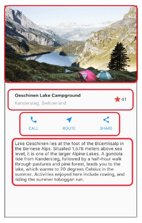

# Flutter Fundamental Pertemuan 7

* Nama  : Diah Putri Nofianti
* NIM   : 2141720054
* Absen : 12
* Kelas : TI-3A

## Praktikum 2: Langkah Awal
Teks yang ditampilkan dalam aplikasi berupa nama lengkap, lalu simpan file screenshot dengan nama `01.png` pada folder images (buat folder baru jika belum ada) di project `flutter_basic` ini.
