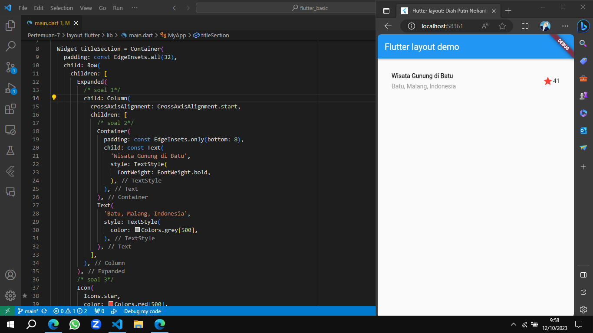

# Flutter Fundamental Pertemuan 7

* Nama  : Diah Putri Nofianti
* NIM   : 2141720054
* Absen : 12
* Kelas : TI-3A

## Tampilan Akhir

## Praktikum 1: Implementasi Title Row
* Letakkan widget Column di dalam widget Expanded agar menyesuaikan ruang yang tersisa di dalam widget Row. Tambahkan properti crossAxisAlignment ke `CrossAxisAlignment.start` sehingga posisi kolom berada di awal baris.

* Letakkan baris pertama teks di dalam Container sehingga memungkinkan Anda untuk menambahkan padding = 8. Teks ‘Batu, Malang, Indonesia' di dalam Column, set warna menjadi abu-abu.

* Dua item terakhir di baris judul adalah ikon bintang, set dengan warna merah, dan teks "41". Seluruh baris ada di dalam Container dan beri padding di sepanjang setiap tepinya sebesar 32 pixel. Kemudian ganti isi body text 'Hello World' dengan variabel `titleSection`.

## Praktikum 2: Implementasi Button Row
Selesaikan langkah-langkah praktikum berikut ini dengan melanjutkan dari praktikum sebelumnya.

### Method Column _buildButtonColumn

* Bagian tombol berisi 3 kolom yang menggunakan tata letak yang sama yaitu sebuah ikon di atas baris teks. Kolom pada baris ini diberi jarak yang sama, dan teks serta ikon diberi warna primer.

* Karena kode untuk membangun setiap kolom hampir sama, buat metode pembantu pribadi bernama `buildButtonColumn()`, yang mempunyai parameter warna, Icon dan Text, sehingga dapat mengembalikan kolom dengan widgetnya sesuai dengan warna tertentu.

### Widget buttonSection

* Buat fungsi untuk menambahkan ikon langsung ke kolom. Teks berada di dalam `Container` dengan margin hanya di bagian atas, yang memisahkan teks dari ikon.

* Bangun baris yang berisi kolom-kolom ini dengan memanggil fungsi dan set warna, Icon, dan teks khusus melalui parameter ke kolom tersebut. Sejajarkan kolom di sepanjang sumbu utama menggunakan `MainAxisAlignment.spaceEvenly` untuk mengatur ruang kosong secara merata sebelum, di antara, dan setelah setiap kolom. Tambahkan kode berikut tepat di bawah deklarasi `titleSection` di dalam metode `build()`.

## Praktikum 3: Implementasi Text Section
Tentukan bagian teks sebagai variabel. Masukkan teks ke dalam Container dan tambahkan padding di sepanjang setiap tepinya.

## Praktikum 4: Implementasi Image Section

* Buatlah folder `images` di root project layout_flutter. Masukkan file gambar tersebut ke folder images, lalu set nama file tersebut ke file `pubspec.yaml`.

* `BoxFit.cover` memberi tahu kerangka kerja bahwa gambar harus sekecil mungkin tetapi menutupi seluruh kotak rendernya.

* Atur semua elemen dalam `ListView`, bukan Column, karena ListView mendukung scroll yang dinamis saat aplikasi dijalankan pada perangkat yang resolusinya lebih kecil.

