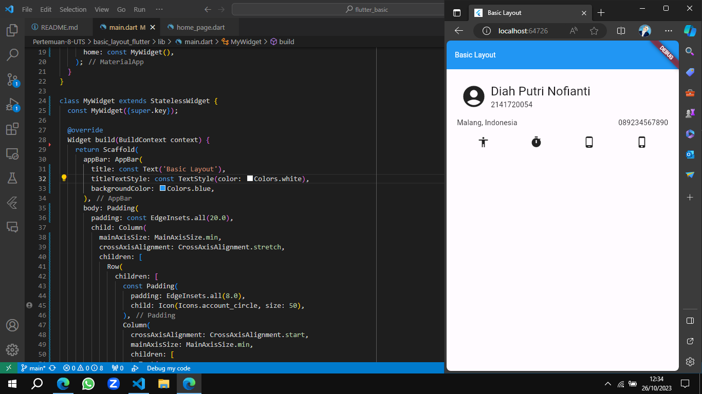
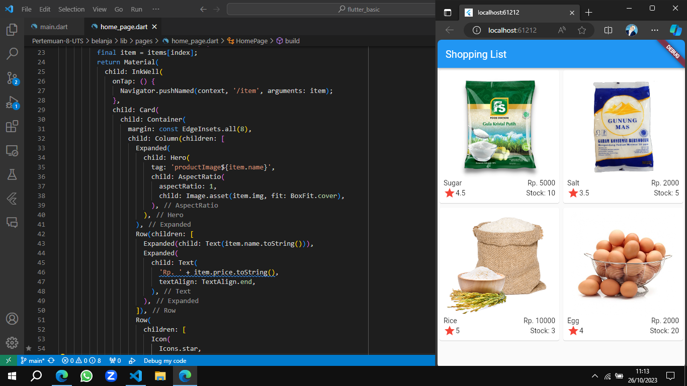
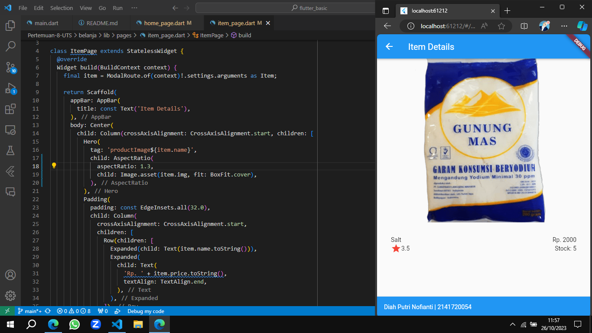

# UTS

* Nama  : Diah Putri Nofianti
* NIM   : 2141720054
* Absen : 12
* Kelas : TI-3A

## Tugas Praktikum 1: Basic Layout Flutter
Sumber: https://docs.flutter.dev/codelabs/layout-basics

### Container Layout
Container adalah widget dasar yang digunakan untuk mengatur tata letak dan dekorasi elemen-elemen lain dalam Flutter.
```dart
Container(
  width: 200,
  height: 100,
  color: Colors.blue,
  child: Center(
    child: Text("Hello, Flutter!"),
  ),
)
  ```

### Row Layout
Row adalah widget yang digunakan untuk mengatur tata letak elemen-elemen dalam satu baris.
```dart
Row(
  mainAxisAlignment: MainAxisAlignment.spaceAround,
  children: [
    Icon(Icons.accessibility),
    Icon(Icons.timer),
    Icon(Icons.phone_android),
    Icon(Icons.phone_iphone),
  ],
)
```

### Column Layout
Column adalah widget yang digunakan untuk mengatur tata letak elemen-elemen dalam satu kolom.
```dart
Column(
  crossAxisAlignment: CrossAxisAlignment.start,
  mainAxisSize: MainAxisSize.min,
  children: [
    Text(
      'Diah Putri Nofianti',
      style: Theme.of(context).textTheme.headlineSmall,
    ),
    const Text('2141720054'),
  ],
),
```

### Stack Layout
Stack adalah widget yang digunakan untuk mengatur tata letak elemen-elemen dengan cara menumpuknya.
```dart
Stack(
  children: <Widget>[
    Container(
      width: 200,
      height: 200,
      color: Colors.red,
    ),
    Container(
      width: 150,
      height: 150,
      color: Colors.green,
    ),
    Container(
      width: 100,
      height: 100,
      color: Colors.blue,
    ),
  ],
)
```

### Image Widget
Image adalah widget yang digunakan untuk menampilkan gambar.
```dart
Image.network(
  "https://jti.polinema.ac.id/wp-content/themes/jti-polinema/images/misc/logo.png",  
)
```

### Hasil


## Praktikum 5: Membangun Navigasi di Flutter

### Langkah 1: Siapkan project baru
Buat sebuah project baru Flutter dengan nama `belanja`.

### Langkah 2: Mendefinisikan Route
Buatlah dua buah file dart dengan nama `home_page.dart` dan `item_page.dart` pada folder `pages`.

* `home_page.dart`
```dart
class HomePage extends StatelessWidget {
    @override
    Widget build(BuildContext context) {
        // TODO
        throw UnimplementedError();
    }
}
```

* `item_page.dart`
```dart
class ItemPage extends StatelessWidget {
    @override
    Widget build(BuildContext context) {
        // TODO
        throw UnimplementedError();
    }
}
```

### Langkah 3: Lengkapi Kode di `main.dart`
```dart
import 'package:belanja/pages/home_page.dart';
import 'package:belanja/pages/item_page.dart';
import 'package:flutter/material.dart';

void main() {
  runApp(MaterialApp(
    initialRoute: '/',
    routes: {
      '/': (context) => HomePage(),
      '/item': (context) => ItemPage(),
    },
  ));
}
```

### Langkah 4: Membuat data model
Buat sebuah file dengan nama `item.dart` dan letakkan pada folder `models`.
```dart
class Item {
  String name;
  int price;

  Item({
    this.name,
    this.price,
  });
}
```

### Langkah 5: Lengkapi kode di class HomePage
Pada halaman `HomePage` terdapat ListView widget. Sumber data ListView diambil dari model List dari object Item.

```dart
class HomePage extends StatelessWidget {
  final List<Item> items = [
    Item(name: 'Sugar', price: 5000),
    Item(name: 'Salt', price: 2000),
  ];
}
```

### Langkah 6: Membuat ListView dan itemBuilder
Untuk menampilkan ListView pada praktikum ini digunakan itemBuilder. Data diambil dari definisi model yang telah dibuat sebelumnya.

```dart
body: Container(
    margin: const EdgeInsets.all(8),
    child: ListView.builder(
        padding: EdgeInsets.all(8),
        itemCount: items.length,
        itemBuilder: (context, index) {
            final item = items[index];
            return Card(
                child: Container(
                margin: const EdgeInsets.all(8),
                    child: Row(
                        children: [
                            Expanded(child: Text(item.name)),
                            Expanded(
                                child: Text(
                                    item.price.toString(),
                                    textAlign: TextAlign.end,
                                ),
                            )
                        ],
                    ),
                ),
            ),              
        },
    ),
);
```

### Langkah 7: Menambahkan aksi pada ListView
```
return Material(
    child: InkWell(
        onTap: () {
            Navigator.pushNamed(context, '/item');
        },
    )
)
```

### Hasil
* `home_page.dart`
```dart
import 'package:belanja/models/item.dart';
import 'package:flutter/material.dart';

class HomePage extends StatelessWidget {
  final List<Item> items = [
    Item(name: 'Sugar', price: 5000),
    Item(name: 'Salt', price: 2000),
  ];

  @override
  Widget build(BuildContext context) {
    return Scaffold(
      appBar: AppBar(
        title: const Text('Shopping List'),
      ),
      body: Container(
        margin: const EdgeInsets.all(8),
        child: ListView.builder(
          itemCount: items.length,
          itemBuilder: (context, index) {
            final item = items[index];
            return Material(
              child: InkWell(
                onTap: () {
                  Navigator.pushNamed(context, '/item');
                },
                child: Card(
                  child: Container(
                    margin: const EdgeInsets.all(8),
                    child: Row(
                      children: [
                        Expanded(child: Text(item.name.toString())),
                        Expanded(
                          child: Text(
                            item.price.toString(),
                            textAlign: TextAlign.end,
                          ),
                        )
                      ],
                    ),
                  ),
                ),
              ),
            );
          },
        ),
      ),
    );
  }
}
```

* `item_page.dart`
```dart
import 'package:belanja/models/item.dart';
import 'package:flutter/material.dart';

class ItemPage extends StatelessWidget {
  @override
  Widget build(BuildContext context) {   
    return Scaffold(
      appBar: AppBar(
        title: const Text('Item Details'),
      ),
      body: Center(
        child: Column(
          mainAxisAlignment: MainAxisAlignment.center,
          children: [Text('${item.name} with ${item.price}')],
        ),
      ),
    );
  }
}
```

* Shopping List


* Item Details


## Tugas Praktikum 2

### Langkah 1
Tambahkan informasi arguments pada penggunaan Navigator.
```dart
Navigator.pushNamed(context, '/item', arguments: item);
```

### Langkah 2
Tambahkan kode pada blok fungsi build dalam halaman ItemPage.
```dart
final itemArgs = ModalRoute.of(context)!.settings.arguments as Item;
```

### Langkah 3
Tambahkan atribut foto produk, stok, dan rating. Ubahlah tampilan menjadi GridView seperti di aplikasi marketplace pada umumnya.
* `item.dart`
```dart
class Item {
  String name, img;
  int price, stock;
  double rating;

  Item({
    required this.name,
    required this.price,
    required this.img,
    required this.stock,
    required this.rating,
  });
}
```

### Langkah 4
Silakan implementasikan Hero widget pada aplikasi belanja.
```dart
Hero(
  tag: item.name,
  child: AspectRatio(
    aspectRatio: 1,
    child: Image.asset(item.img, fit: BoxFit.cover),
  ),
),
```

### Langkah 5
Tambahkan Nama dan NIM di footer.
```dart
bottomNavigationBar: BottomAppBar(
  child: Container(
    padding: const EdgeInsets.all(16),
    decoration: const BoxDecoration(
      color: Colors.blue,
    ),
    child: const Row(
      children: [
        Text(
            'Diah Putri Nofianti | 2141720054',
            style: TextStyle(
              color: Colors.white,
            ),
        ),
      ],
    ),
  ),
),
```

### Hasil

* Shopping List


* Item Details
