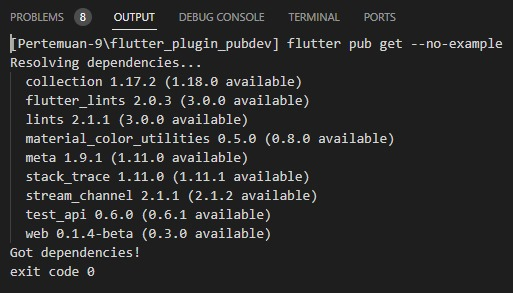
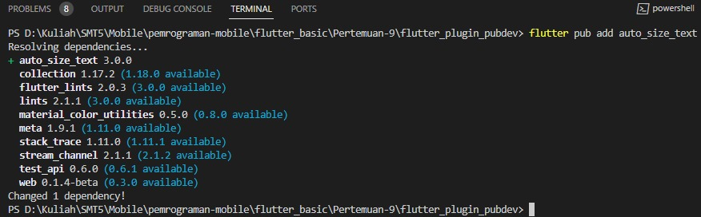

# Manajemen Plugin

* Nama  : Diah Putri Nofianti
* NIM   : 2141720054
* Absen : 12
* Kelas : TI-3A

## Dokumentasi Langkah
### Langkah 1: Buat Project Baru
Buat sebuah project flutter baru dengan nama `flutter_plugin_pubdev`

### Langkah 2: Menambahkan Plugin
```dart
flutter pub add auto_size_text
```
#### Output

#### Terminal

* Penjelasan: 

### Langkah 3: Buat file `red_text_widget.dart`

```dart
import 'package:flutter/material.dart';

class RedTextWidget extends StatelessWidget {
  const RedTextWidget({Key? key}) : super(key: key);

  @override
  Widget build(BuildContext context) {
    return Container();
  }
}
```

### Langkah 4: Tambah Widget `AutoSizeText`
Ubahlah kode `return Container()`
```dart
return AutoSizeText(
      text,
      style: const TextStyle(color: Colors.red, fontSize: 14),
      maxLines: 2,
      overflow: TextOverflow.ellipsis,
);
```
* Terdapat `error`:

### Langkah 5: Buat Variabel text dan parameter di constructor

```dart
final String text;

const RedTextWidget({Key? key, required this.text}) : super(key: key);
```

* Penjelasan: 

### Langkah 6: Tambahkan widget di `main.dart`
Di dalam `children:` pada class `_MyHomePageState`
```dart
Container(
   color: Colors.yellowAccent,
   width: 50,
   child: const RedTextWidget(
             text: 'You have pushed the button this many times:',
          ),
),

Container(
    color: Colors.greenAccent,
    width: 100,
    child: const Text(
           'You have pushed the button this many times:',
          ),
),
```
- Terdapat dua widget yang ditambahkan, jelaskan fungsi dan perbedaannya!

#### Jelaskan maksud dari tiap parameter yang ada di dalam plugin auto_size_text berdasarkan tautan pada dokumentasi [ini](https://pub.dev/documentation/auto_size_text/latest/)!