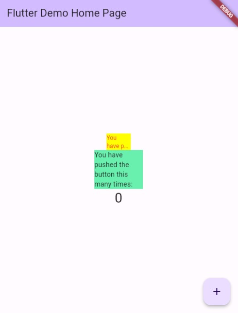

# Manajemen Plugin

* Nama  : Diah Putri Nofianti
* NIM   : 2141720054
* Absen : 12
* Kelas : TI-3A

## Dokumentasi Langkah

### Langkah 1: Buat project baru
Buat sebuah project flutter baru dengan nama `flutter_plugin_pubdev`

### Langkah 2: Menambahkan plugin
```dart
flutter pub add auto_size_text
```

#### Terminal


#### Output

* **Penjelasan:** Menambahkan plugin `auto_size_text` berarti menginstal package `auto_size_text` yang merupakan widget Flutter yang dapat menyesuaikan ukuran teks secara otomatis agar sesuai dengan batasnya. Package ini berguna untuk membuat tampilan teks yang responsif dan fleksibel di berbagai ukuran layar.

### Langkah 3: Buat file `red_text_widget.dart`

```dart
import 'package:flutter/material.dart';

class RedTextWidget extends StatelessWidget {
  const RedTextWidget({Key? key}) : super(key: key);

  @override
  Widget build(BuildContext context) {
    return Container();
  }
}
```

### Langkah 4: Tambah widget `AutoSizeText`
Ubahlah kode `return Container()`

```dart
return AutoSizeText(
      text,
      style: const TextStyle(color: Colors.red, fontSize: 14),
      maxLines: 2,
      overflow: TextOverflow.ellipsis,
);
```

* **Terdapat `error`:** Tambahkan saja import package untuk `auto_size_text`

```dart
import 'package:auto_size_text/auto_size_text.dart';
```

### Langkah 5: Buat variabel text dan parameter di constructor

```dart
final String text;

const RedTextWidget({Key? key, required this.text}) : super(key: key);
```

**Penjelasan:** Kode di atas berfungsi untuk membuat suatu kotak teks khusus yang akan menampilkan teks dengan warna merah pada aplikasi. Di sini, ada dua hal penting:

1. Variabel `text` yang digunakan untuk menampung teks yang akan ditampilkan dalam kotak teks ini.

2. Konstruktor `RedTextWidget` yang adalah pembuat kotak teks ini. Konstruktor ini memerlukan satu hal yang harus diisi, yaitu teks yang ingin ditampilkan di dalam kotak tersebut. Sementara itu, ada juga opsi untuk memberikan kunci unik (key) jika dibutuhkan.

### Langkah 6: Tambahkan widget di `main.dart`
Di dalam `children:` pada class `_MyHomePageState`
```dart
Container(
   color: Colors.yellowAccent,
   width: 50,
   child: const RedTextWidget(
             text: 'You have pushed the button this many times:',
          ),
),

Container(
    color: Colors.greenAccent,
    width: 100,
    child: const Text(
           'You have pushed the button this many times:',
          ),
),
```
***Terdapat dua widget yang ditambahkan, jelaskan fungsi dan perbedaannya!***
1. **Yellow**
* `Container` dengan latar belakang berwarna kuning muda.
* Lebarnya ditentukan 50 pixel.
* Di dalam `Container`, terdapat widget `RedTextWidget` yaitu widget khusus dengan menjadikan text berwarna **merah** yang telah dibuat sebelumnya, dan di sini akan diisi dengan teks yang akan ditampilkan.

2. **Green**
* Ini juga `Container`, tetapi dengan latar belakang berwarna hijau muda.
* Lebarnya 100 pixel.
* Di dalam `Container` ini, terdapat widget `Text` yang langsung menampilkan teks yang sama seperti sebelumnya.

3. **Perbedaan**
* Widget pertama menggunakan `RedTextWidget`, yang dibuat khusus untuk menampilkan teks dengan warna merah. Widget kedua, hanya menggunakan widget bawaan `Text` untuk menampilkan teks tanpa pengaturan warna khusus. Jadi, widget pertama akan menampilkan teks dengan warna merah, sementara widget kedua akan menampilkan teks dengan warna default.

## Hasil


### ***Jelaskan maksud dari tiap parameter yang ada di dalam plugin auto_size_text berdasarkan tautan pada dokumentasi [ini](https://pub.dev/documentation/auto_size_text/latest/)!***

1. **key:** Mengendalikan bagaimana satu widget menggantikan widget lain dalam pohon (tree), digunakan untuk mengidentifikasi widget secara unik.

2. **textKey:** Menentukan kunci (key) untuk widget `Text` yang dihasilkan.

3. **style:** Digunakan untuk mengatur gaya (style) teks seperti jenis huruf, ukuran, warna, dan lainnya.

4. **minFontSize:** Menentukan ukuran teks minimum yang akan digunakan saat menyesuaikan ukuran teks secara otomatis. Dapat diabaikan jika `presetFontSizes` diatur.

5. **maxFontSize:** Menentukan ukuran teks maksimum yang akan digunakan saat menyesuaikan ukuran teks secara otomatis.

6. **stepGranularity:** Ukuran langkah di mana ukuran huruf disesuaikan dengan batasan.

7. **presetFontSizes:** Memungkinkan menentukan ukuran huruf yang sudah ditentukan sebelumnya. Harus diatur dalam urutan menurun (dari besar ke kecil).

8. **group:** Digunakan untuk menyelaraskan ukuran beberapa `AutoSizeText`.

9. **textAlign:** Menentukan cara teks diatur secara horizontal, seperti tengah, kiri, atau kanan.

10. **textDirection:** Menentukan arah teks, yang memengaruhi bagaimana nilai `textAlign` seperti `TextAlign.start` dan `TextAlign.end` diinterpretasikan.

11. **locale:** Digunakan untuk memilih jenis huruf yang benar saat karakter Unicode yang sama dapat ditampilkan secara berbeda tergantung pada budaya (locale).

12. **softWrap:** Mengontrol apakah teks harus mengalami pemisahan pada batas baris yang lunak.

13. **wrapWords:** Menentukan apakah kata-kata yang tidak muat dalam satu baris harus dipisahkan atau tidak. Secara default, nilainya adalah `true` agar berperilaku seperti widget `Text`.

14. **overflow:** Menentukan cara penanganan tampilan teks yang berlebihan (overflow).

15. **overflowReplacement:** Jika teks berlebihan dan tidak muat dalam batasan, widget ini akan ditampilkan sebagai pengganti.

16. **textScaleFactor:** Mengontrol berapa banyak pixel huruf yang digunakan untuk setiap pixel logis. Juga memengaruhi `minFontSize`, `maxFontSize`, dan `presetFontSizes`.

17. **maxLines:** Menentukan jumlah maksimum baris yang dapat digunakan oleh teks.

18. **semanticsLabel:** Label alternatif untuk keperluan aksesibilitas (semantics).