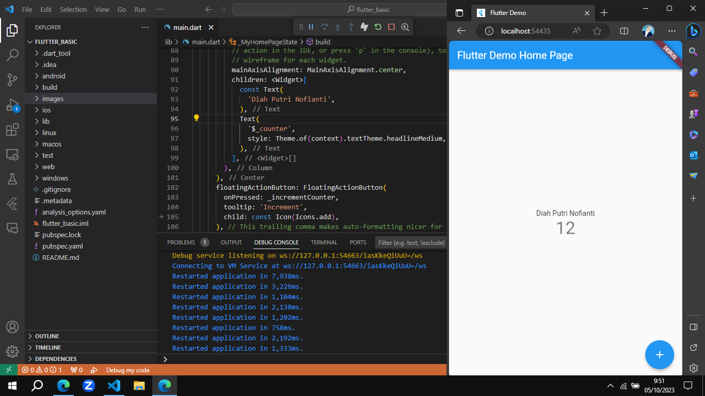
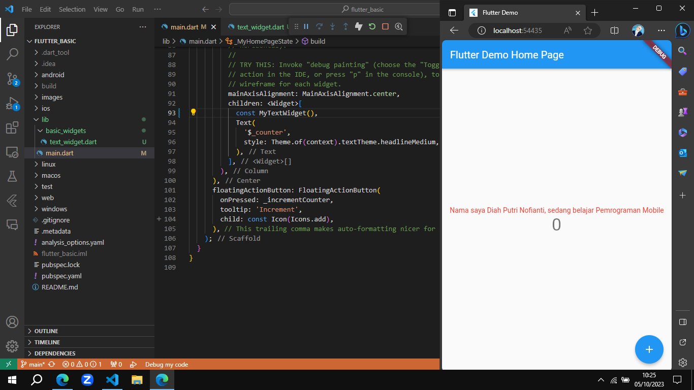
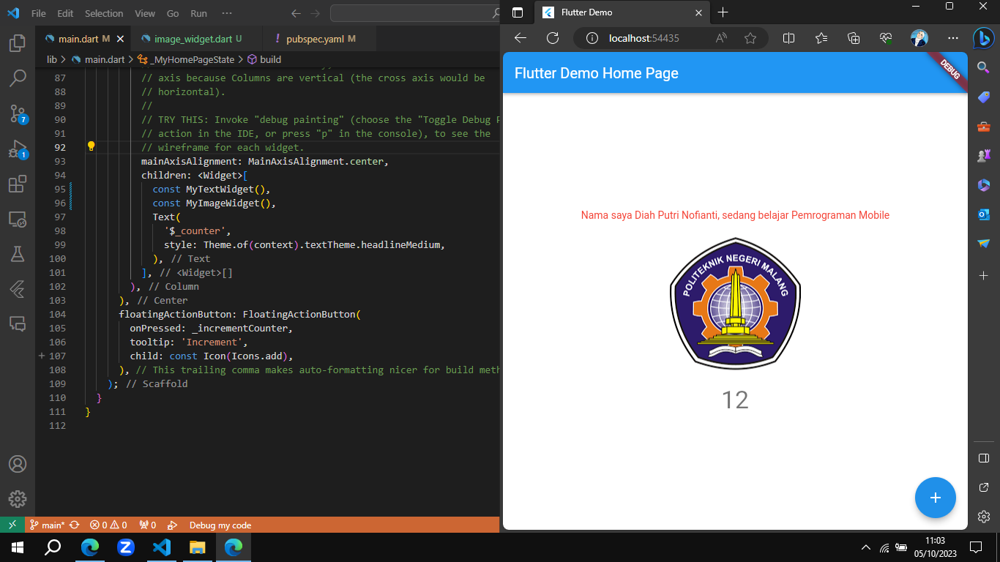

# Flutter Basic

A new Flutter project.

## Praktikum 2: Langkah Awal

## Praktikum 3: Menerapkan Widget Dasar

1. Text Widget

2. Image Widget

## Praktikum 4: Menerapkan Widget Material Design

1. Cupertino Button dan Loading Bar