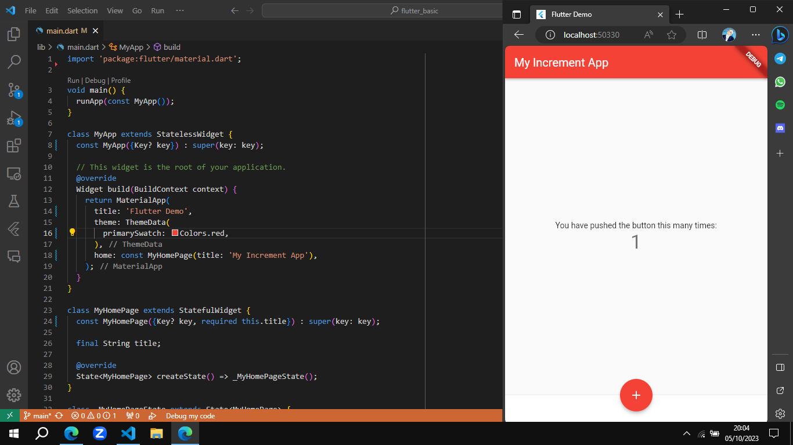
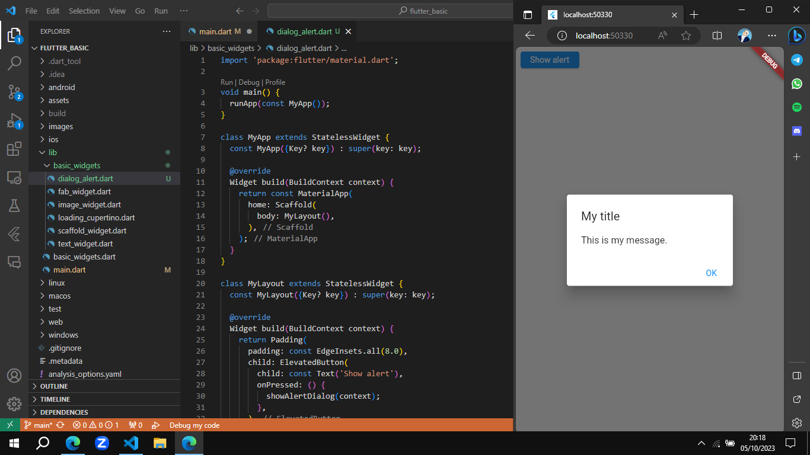
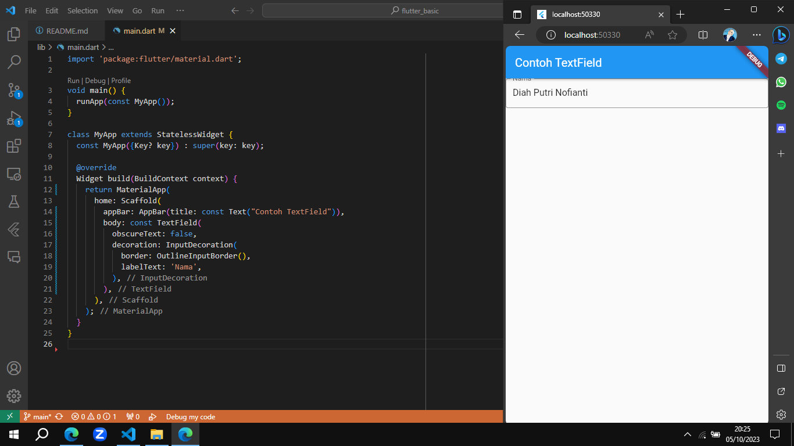
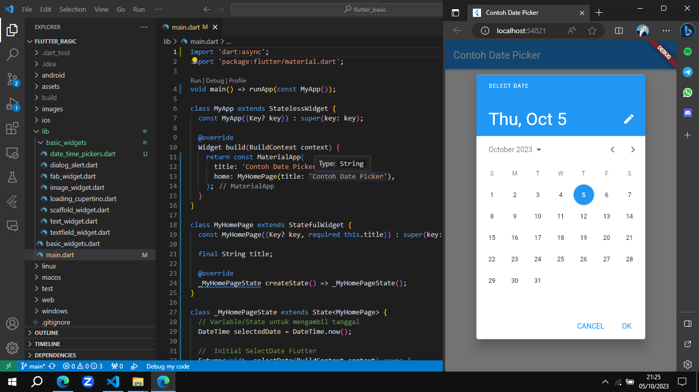

# Flutter Basic

* Nama  : Diah Putri Nofianti
* NIM   : 2141720054
* Absen : 12
* Kelas : TI-3A

## Praktikum 2: Langkah Awal
Teks yang ditampilkan dalam aplikasi berupa nama lengkap, lalu simpan file screenshot dengan nama `01.png` pada folder images (buat folder baru jika belum ada) di project `flutter_basic` ini.

## Praktikum 3: Menerapkan Widget Dasar

1. Text Widget
* Buat folder baru `basic_widgets` di dalam folder lib. Kemudian buat file baru di dalamnya dengan nama `text_widget.dart`.

2. Image Widget
* Buat sebuah file `image_widget.dart` di dalam folder `basic_widgets`. Lakukan penyesuaian asset pada file `pubspec.yaml` dan tambahkan file logo Polinema di folder `assets`.

## Praktikum 4: Menerapkan Widget Material Design dan iOS Cupertino

1. Cupertino Button dan Loading Bar
* Buat file di `basic_widgets` > `loading_cupertino.dart`. Import stateless widget dari material dan cupertino. 

2. Floating Action Button (FAB)
* Button widget terdapat beberapa macam pada flutter yaitu ButtonBar, DropdownButton, TextButton, FloatingActionButton, IconButton, OutlineButton, PopupMenuButton, dan ElevatedButton. 

* Buat file di `basic_widgets` > `fab_widget.dart`. Import stateless widget dari material.

3. Scaffold Widget
* Scaffold widget digunakan untuk mengatur tata letak sesuai dengan material design.

4. Dialog Alert
* Dialog widget pada flutter memiliki dua jenis dialog yaitu `AlertDialog` dan `SimpleDialog`.

5. Input dan Selection Widget
* Flutter menyediakan widget yang dapat menerima input dari pengguna aplikasi yaitu antara lain Checkbox, Date and Time Pickers, Radio Button, Slider, Switch, TextField.

6. Date and Time Pickers
* Date and Time Pickers termasuk pada kategori input dan selection widget.
